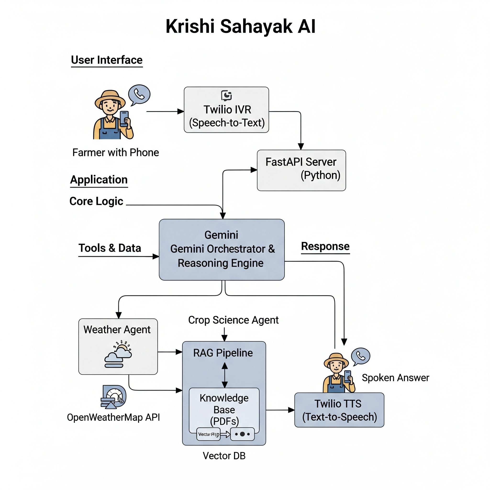

# Krishi Sahayak AI (कृषि सहायक AI)

**Vision: To empower every farmer in India with instant, reliable, and accessible agricultural advice through a simple phone call.**

   

---

## 🌾 The Problem: The Information Gap in Indian Agriculture

Indian farmers are the backbone of our nation's economy, yet they face immense challenges daily. Critical, timely information about weather, crop diseases, irrigation schedules, and fair market prices is often fragmented, unreliable, or locked behind a digital divide. This information gap leads to reduced yields, financial uncertainty, and significant stress. While many digital solutions exist, they often require smartphones and internet access, leaving a vast majority of farmers behind.

## 💡 Our Solution: An AI Advisor on a Simple Phone Call

Krishi Sahayak AI is a voice-first, AI-powered advisory system designed to bridge this gap. We are building a system that any farmer can access by calling a regular Indian phone number.

### Core Features:

- **🎙️ Voice-First Interface**: No app, no internet required. Just a simple, direct phone call.
- **🤖 Agentic AI Brain**: Powered by Google's Gemini, our AI doesn't just guess. It uses a set of specialized tools to find factual answers.
- **📚 Grounded in Facts**: Our AI's advice is based on a Retrieval-Augmented Generation (RAG) pipeline. This means it retrieves information from verified sources—like agricultural university research papers and official government data—before synthesizing an answer. This is our commitment to preventing AI hallucinations and building trust.
- **🛠️ Comprehensive Toolkit**: The AI can access real-time weather forecasts, UV index, air pollution data, and query our custom knowledge base for scientific crop advice.

## 🏗️ System Architecture



The system follows a modular, voice-first architecture:

1. **User Interface Layer**: Farmers call a regular phone number, no smartphone required
2. **Telephony Layer**: Exotel IVR handles speech-to-text conversion
3. **Application Core**: FastAPI server processes requests and orchestrates AI responses
4. **AI Brain**: Gemini-powered reasoning engine with specialized agents:
   - **Weather Agent**: Real-time weather data via OpenWeatherMap API
   - **Crop Science Agent**: RAG pipeline accessing agricultural knowledge base
5. **Knowledge Base**: Vector database (ChromaDB) storing agricultural research papers and guidelines
6. **Response Layer**: Text-to-speech conversion delivers spoken answers back to farmers

---

## 🚀 Live Demo Status

We have a fully functional end-to-end prototype! Thanks to our switch to an India-native telephony provider, you can test the system right now.

- **Provider**: Exotel (Free Trial)
- **Phone Number**: A real, callable Indian virtual number
- **How it Works**: Call the number, and our ngrok-tunneled local server will answer, process your spoken question, and provide a synthesized voice response.

---

## 🛠️ Technology Stack

- **Core Logic**: Python
- **AI Orchestration**: Google Gemini Pro, LangChain
- **Web Framework**: FastAPI
- **Telephony (IVR)**: Exotel (for Indian number compatibility)
- **Knowledge Base**: ChromaDB (Vector Store), PyPDFLoader
- **External Data APIs**: PyOWM (for Weather, UV, Air Pollution)
- **Deployment (Demo)**: Uvicorn, ngrok

---

## 🤝 Getting Started: How to Contribute

We are thrilled to have you join us! Follow these steps to get the project running on your local machine.

### Prerequisites

- Python 3.9+
- An Exotel Free Trial account
- API keys for Google AI Studio and OpenWeatherMap

### Installation & Setup

1. **Clone the Repository:**
   ```bash
   git clone [URL_OF_YOUR_GIT_REPOSITORY]
   cd krishi_sahayak_ai
   ```

2. **Create a Virtual Environment:**
   ```bash
   python3 -m venv venv
   # On Windows
   venv\Scripts\activate
   # On macOS/Linux
   source venv/bin/activate
   ```

3. **Install Dependencies:**
   ```bash
   pip install -r requirements.txt
   ```

4. **Configure Environment Variables:**
   - Make a copy of `.env.example` (or create a new file) and name it `.env`
   - Fill in your API keys and Exotel credentials in the `.env` file

5. **Build the Knowledge Base:**
   
   **Option A: Complete Setup (PDF + KCC Data) [RECOMMENDED]**
   ```bash
   # First run PDF ingestion
   python app/knowledge_base/ingest.py
   
   # Then run KCC ingestion for real farmer data
   python app/knowledge_base/ingest_kcc_data.py
   ```
   
   **Option B: PDF Documents Only**
   ```bash
   # Place your agricultural PDF documents into data/source_documents/
   python app/knowledge_base/ingest.py
   ```
   
   The KCC integration adds 50,000+ real farmer queries and expert answers from the official government agricultural helpline database.

### Running the Application

1. **Start the AI Server:**
   ```bash
   uvicorn app.main:app --reload --host 0.0.0.0 --port 8000
   ```

2. **Expose Your Server with ngrok:**
   - Open a new terminal
   - Start ngrok to create a public URL for your server:
   ```bash
   ngrok http 8000
   ```
   - Copy the `https://` forwarding URL provided by ngrok

3. **Configure Exotel:**
   - Log in to your Exotel dashboard
   - Go to the "App Bazaar" and create a call flow
   - Point the "Connect" applet to your ngrok URL: `[YOUR_NGROK_URL]/handle-call-initial`
   - Remember to update the `YOUR_NGROK_URL` placeholder in `app/main.py` as well!

**You are now ready to call your Exophone and interact with the AI!**

---

## 🗺️ Our Roadmap: The Plan Ahead

Our vision is big, and we need your help to get there. We've broken down our plan into clear, achievable phases.

### Phase 1: Solidify the Core (Current Focus)
- [x] Build the agentic core with Gemini and LangChain
- [x] Implement a robust RAG pipeline with ChromaDB
- [x] Integrate live weather data tools
- [x] Set up a working IVR demo with an Indian number (Exotel)
- [ ] **Next Up**: Implement robust logging and error handling
- [ ] **Next Up**: Write unit tests for our core tools and agent logic

### Phase 2: Expand the Knowledge & Capabilities
- [x] **KCC Real-World Data**: Successfully integrated 50,000+ farmer queries and expert answers from the official Kisan Call Centre database
- [ ] **Integrate Market Prices**: Connect our `get_market_prices` tool to the official Agmarknet APIs from data.gov.in. This is our highest priority new feature.
- [ ] **Add More Languages**: Fine-tune our Speech-to-Text and Text-to-Speech to support Hindi, and later, other regional languages.
- [ ] **Government Schemes Agent**: Create a new agent that queries a knowledge base of Central and State government farmer welfare schemes.
- [ ] **Visual Analysis**: Allow farmers to send an image (e.g., via WhatsApp) of a diseased plant, and have an AI agent analyze it.

### Phase 3: Enhance the User Experience
- [ ] **Introduce Memory**: Implement conversation history so the AI can remember the context of a farmer's previous questions.
- [ ] **WhatsApp Bot**: Create a parallel interface via a WhatsApp chatbot for users who prefer text and images.
- [ ] **Personalization**: Allow farmers to optionally save their location and primary crops for more tailored advice.

---

## 🌱 Core Principles

- **Farmer-First**: Every feature we build must be easy to use, accessible, and solve a real-world problem for farmers.
- **Trust Through Grounding**: We will always prioritize factual accuracy. Our AI is designed to be an explainer of verified data, not a creator of new information.
- **Open and Collaborative**: We believe the best solutions are built together. All ideas are welcome.

---

## 📂 Project Structure

```
krishi_sahayak_ai/
├── README.md
├── requirements.txt
├── app/
│   ├── __init__.py
│   ├── main.py              # FastAPI application entry point
│   ├── agentic_core.py      # Core AI agent logic
│   ├── tools.py             # AI tools (weather, knowledge base, etc.)
│   └── knowledge_base/
│       ├── __init__.py
│       └── ingest.py        # PDF ingestion and vector store creation
├── data/
│   └── source_documents/    # Agricultural PDF documents
└── vector_store/            # ChromaDB vector database
```

---

## 🤝 Contributing

We welcome contributions from developers, agricultural experts, and anyone passionate about empowering farmers! Here's how you can help:

1. **Fork the repository**
2. **Create a feature branch** (`git checkout -b feature/amazing-feature`)
3. **Commit your changes** (`git commit -m 'Add some amazing feature'`)
4. **Push to the branch** (`git push origin feature/amazing-feature`)
5. **Open a Pull Request**

### Areas Where We Need Help:
- Integration with government agricultural APIs
- Multi-language support (Hindi, regional languages)
- UI/UX improvements for voice interactions
- Documentation and testing
- Mobile app development (future phase)

---

**We are incredibly excited to build this future with you. Let's empower our farmers, together.** 🌾🤝

---

*Made with ❤️ for Indian farmers*
